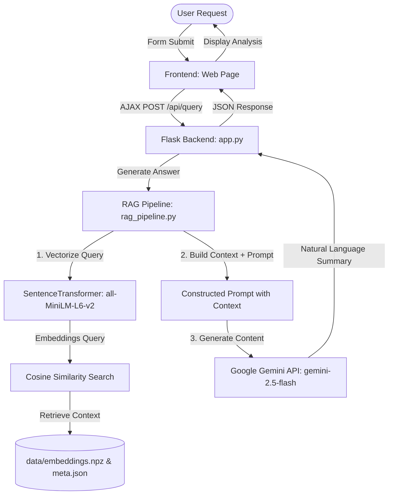

# revü | AI-Powered Company Culture Analyzer

**revü** is a Retrieval-Augmented Generation (RAG) web application designed to analyze employee reviews and star ratings to provide deep insights into company culture. Instead of manually reading hundreds of reviews, users can query the application to get a consolidated, fact-based summary of a company's work environment, ratings, and sentiments, powered by advanced language models.

---

## 🚀 Key Features

- **Semantic Retrieval**: Searches for employee reviews using semantic similarity instead of simple keyword matching.
- **Company-Specific Filtering**: Ability to target queries to a specific company or query the general reviews database.
- **AI-Powered Synthesis**: Uses the fast and powerful **Google Gemini API** (`gemini-2.5-flash-preview-05-20`) to synthesize detailed, 4-6 sentence natural language answers grounded in retrieved context.
- **Star Ratings Integration**: Provides a summarized score out of 10 for the queried culture aspect.
- **Dual-Embedding Pipelines**:
  - Offline local embeddings via **Sentence-Transformers** (`all-MiniLM-L6-v2`).
  - Online cloud embeddings via **OpenAI** (`text-embedding-3-small`).
- **Interactive UI**: A clean, modern, and responsive user interface built using vanilla HTML/CSS and JavaScript.

---

## 🏗️ Architecture & RAG Pipeline



1. **Embedding Generation (`embeddings.py`)**: Fetches reviews from a Google Sheets CSV endpoint. It parses and formats company, rating, role, and review content into text chunks. It then vectorizes them and saves the result to `data/embeddings.npz` and `data/meta.json`.
2. **Retrieval**: When a query is made, the text is embedded using `all-MiniLM-L6-v2`. We calculate the cosine similarity between the query embedding and the pre-computed review embeddings (optionally filtered by company). The top $k$ reviews (default $5$) are retrieved.
3. **Augmentation & Generation**: The text of the top 5 reviews is formatted as context and sent along with the user query to the Gemini API to generate a final grounded response.

---

## 📁 Repository Structure

```text
company_analyzer2/
├── app.py                  # Flask backend server containing UI routes & API endpoints
├── embeddings.py           # Script to parse Google Sheet data and build vector embeddings
├── rag_pipeline.py         # Search, retrieval, and LLM text generation logic
├── requirements.txt        # Python dependency list
├── testing.py              # Simple print utility (scratchpad/test script)
├── data/
│   ├── reviews.csv         # Raw CSV copy of company reviews
│   ├── embeddings.npz      # Pre-computed NumPy database of review embeddings
│   └── meta.json           # Metadata for review sources (company, role, rating, etc.)
├── templates/
│   └── index.html          # Web application UI template (with integrated styles)
└── static/
    ├── script.js           # AJAX logic for form submission & UI states
    └── styles.css          # Optional external stylesheet for UI components
```

---

## 🛠️ Setup & Installation

### Prerequisites
- Python 3.8 or higher installed.
- A **Google Gemini API Key** (required).
- An **OpenAI API Key** (optional, only if using OpenAI for embedding generation).

### 1. Clone the Repository
```bash
git clone https://github.com/mamboo108/company_analyzer2.git
cd company_analyzer2
```

### 2. Set Up a Virtual Environment
Create and activate a Python virtual environment:
```bash
# On Windows (PowerShell)
python -m venv venv
.\venv\Scripts\Activate.ps1

# On macOS/Linux
python3 -m venv venv
source venv/bin/activate
```

### 3. Install Dependencies
```bash
pip install -r requirements.txt
```

### 4. Configure Environment Variables
Create a `.env` file in the root directory and add your API keys:
```env
# Required for RAG generation
GEMINI_API_KEY=your_google_gemini_api_key_here

# Optional: Add if you want to use OpenAI embeddings in embeddings.py
OPENAI_API_KEY=your_openai_api_key_here
EMBEDDING_MODEL=text-embedding-3-small

# Optional override paths
EMB_PATH=data/embeddings.npz
META_PATH=data/meta.json
PORT=5000
```

---

## ⚡ Running the Application

### Step 1: Re-build or Update Embeddings (Optional)
The project comes with pre-computed embeddings in `data/`. If you want to update the reviews dataset from Google Sheets, run the embedding script:
```bash
python embeddings.py
```
> [!IMPORTANT]
> By default, `rag_pipeline.py` uses the local SentenceTransformer model `all-MiniLM-L6-v2` (384 dimensions) for querying. If you generate embeddings using OpenAI (`use_openai=True` in `embeddings.py`), you will need to update `rag_pipeline.py`'s `embed_query` function to use OpenAI's API as well to avoid a vector dimension mismatch.

### Step 2: Run the Web Server
Launch the Flask development server:
```bash
python app.py
```
Open your browser and navigate to `http://127.0.0.1:5000` (or the port defined in your `.env`).

---

## 🛠️ Technologies Used

- **Backend**: [Flask](https://flask.palletsprojects.com/), [Flask-CORS](https://flask-cors.corydolphin.com/), [Gunicorn](https://gunicorn.org/)
- **Data & Vector Processing**: [NumPy](https://numpy.org/), [Pandas](https://pandas.pydata.org/)
- **Embedding Models**: [Sentence-Transformers](https://sbert.net/) (`all-MiniLM-L6-v2`), [OpenAI API](https://platform.openai.com/) (`text-embedding-3-small`)
- **LLM API**: [Google Generative AI SDK](https://github.com/google/generative-ai-python) (`gemini-2.5-flash-preview-05-20`)
- **Frontend**: HTML5, CSS3 (Poppins typography, custom gradients), Vanilla JavaScript (ES6 Fetch)

---

## 👥 Team & Contributors

The development and integration of **revü** was divided among the team as follows:

| Contributor | Role | Core Responsibilities & Contributions |
| :--- | :--- | :--- |
| **Aaisha M Najeeb** | Lead Backend & RAG Architect | Setup core RAG pipeline, semantic search logic, Cosine similarity computation, and Gemini prompting/synthesis (`rag_pipeline.py`). |
| **Antony George Mampilly** | Backend & Integration Developer | Developed Flask routing server (`app.py`), backend API endpoints, metadata serialization, and wired backend connection with frontend queries (`static/script.js`). |
| **Jiss Maria Jose** | Data & Embedding Pipeline Engineer | Engineered ETL pipelines for Google sheets review data, data pre-processing, chunking, and precomputing local/cloud embeddings database (`embeddings.py`, `data/`). |
| **Shakkira V A** | Frontend Developer | Designed visual UI layouts, interactive theme-toggle interface, CSS layouts, typography, and responsive styling (`templates/index.html`, `static/styles.css`). |


